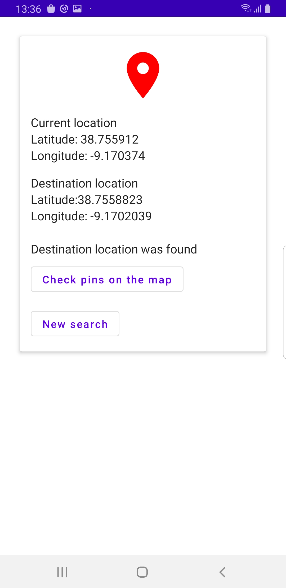
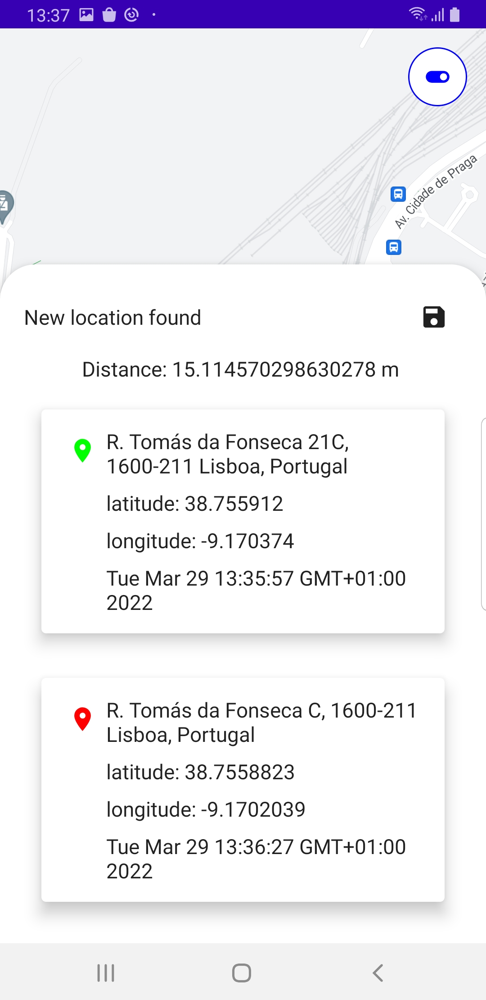
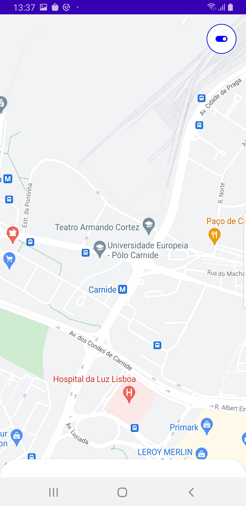

# Atlas-Locations
App that tracks a specific distance

## The Brief

App that tracks the distance between the user current location and X amount of meters.
The app has two screens. One to track and another to show pins on the map

In order to use the app you should introduce your own api key on the manifest file.
To change the distance change the variable VALID_DISTANCE_BETWEEN_PINS on the file LocationHelper

When a location is found you can check it on a map and on a bottom sheet for more details.

There is an alternative style available for the map 

## Architecture & Libraries
    - MVI
    - ROOM Database
    - Dependency Injection - Dagger-Hilt
    - Kotlin Coroutines
    - Flow

## App preview:

Image #1            |  Image #2             |  Image #3           
:-------------------------:|:----------------------------:|:----------------------------:
    |       |   

## Future:

Show a history of previews distances
